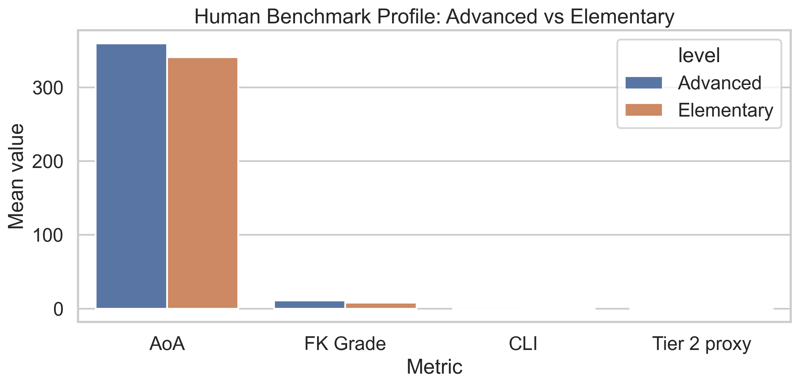
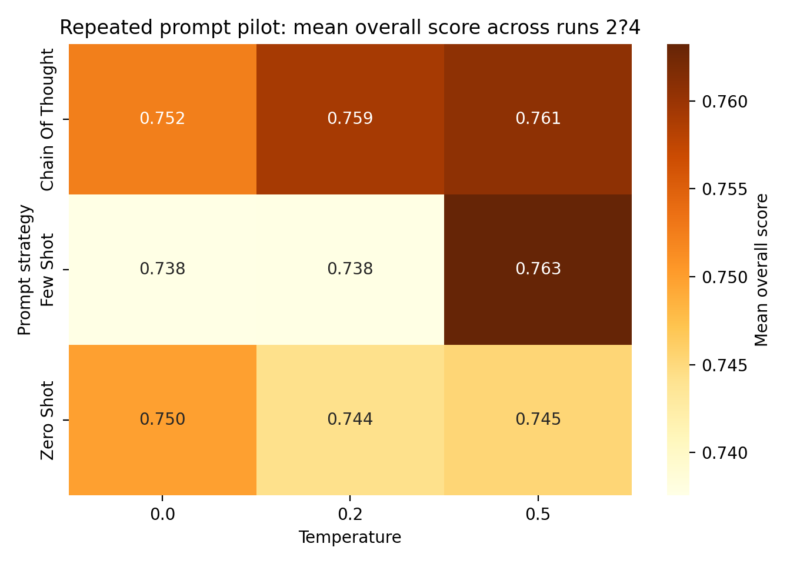
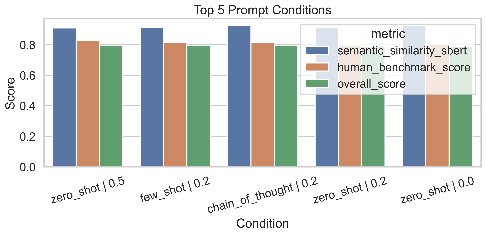
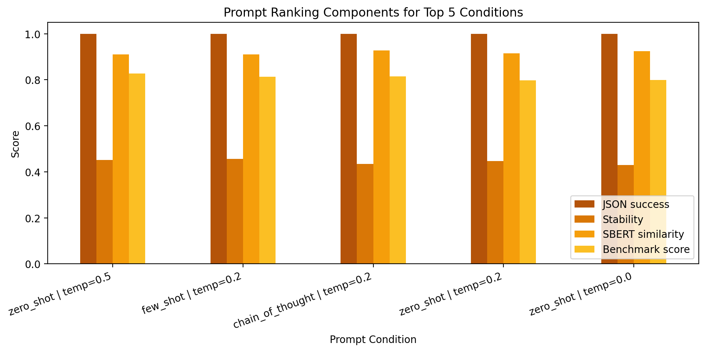

# Full Results Explainer

This document explains the current results of the thesis pipeline in detail. It is meant to help with three things:

1. understanding what each reported number means,
2. understanding why the number is roughly what it is,
3. understanding what the number allows you to claim in the thesis.

At the moment, the available result sets are:

- the `human benchmark` under the local pipeline,
- the `human pairwise comparison` between Advanced and Elementary texts,
- the `prompt-selection pilot` for the LLM settings.

The full `LLM versus human` comparison for the selected prompt condition is not yet completed, so this document explains the current benchmark and pilot results in full detail and marks the missing part explicitly.

## 1.1 Overall Logic Of The Thesis Pipeline

The overall logic of the project is good and methodologically defensible, but only if it is explained as a connected sequence rather than as a bag of separate metrics.

The sequence is:

1. start from an `Advanced` educational text,
2. generate or observe a simplified version,
3. check whether the simplified version is easier to read,
4. check whether it still preserves useful vocabulary for learning,
5. check whether it still preserves the original meaning,
6. compare that behavior against the `human Elementary` benchmark,
7. use the prompt pilot to choose the LLM setting that best matches this balance.

Why this logic is good:

- it does not confuse `easy to read` with `educationally good`,
- it uses a human benchmark instead of arbitrary target values,
- it combines accessibility, vocabulary retention, and semantic preservation,
- it remains reproducible because every metric is computed locally.

Why this logic is not perfect:

- the Tier 2 component is still a proxy based on the `Academic Vocabulary List`, not a gold-standard pedagogical Tier 2 lexicon,
- `Sentence-BERT` is a semantic guardrail, not a full factuality verifier,
- `FKGL` is useful as a standard baseline, but not rich enough on its own,
- the final quality claim still depends on whether the selected LLM condition behaves similarly to the human benchmark.

## 1. Files This Explanation Refers To

Main result files:

- [text_metric_summary.csv](D:/Year-3-Uni/thesis/Code/LGP-score/outputs/human_baseline_summaries/text_metric_summary.csv:1)
- [pairwise_summary.csv](D:/Year-3-Uni/thesis/Code/LGP-score/outputs/human_baseline_summaries/pairwise_summary.csv:1)
- [pilot_condition_ranked.csv](D:/Year-3-Uni/thesis/Code/LGP-score/outputs/pilot_ranking_local/pilot_condition_ranked.csv:1)

Main figures:

## 2. How To Read The Summary Numbers

Before looking at the specific values, it is important to know what the summary columns mean.

- `count`: how many texts contributed to the statistic.
- `mean`: the arithmetic average across texts.
- `std`: the standard deviation, which shows how much the values vary across texts.
- `median`: the middle value when the texts are ordered from low to high.

Why this matters:

- the `mean` tells you the average tendency,
- the `std` tells you whether that tendency is stable or highly variable,
- the `median` helps check whether the mean is being pulled up or down by extreme cases.

In the human benchmark tables, `count = 189` for each level because the corpus contains `189` aligned stories for the three levels used in the summary.

## 2.1 Direction Arrows

To make the interpretation easier, the thesis tables now use arrows next to the metric names.

These arrows do **not** mean that one direction is universally good in every possible context. Instead, they indicate the direction observed in the human benchmark and therefore the direction that later LLM outputs are expected to approximate if they are behaving in a human-like way.

The main arrow logic is:

- `AoA ↓`: lower is expected, because simpler texts should use earlier-acquired vocabulary.
- `Concreteness ≈`: almost no systematic shift is observed in the benchmark, so large changes would be suspicious.
- `Imageability ↑`: a small increase is observed in the benchmark.
- `FKGL ↓`: lower readability grade is expected.
- `MTLD ↓`: lower lexical diversity is observed in the benchmark.
- `CLI ↑`: higher combined accessibility is expected.
- `Tier 2 proxy ↓`: a moderate decrease is observed in the benchmark, but too large a decrease may indicate over-simplification.
- `SBERT similarity ↑`: higher semantic preservation is better.

This matters because some negative values are good and some are bad depending on the metric:

- `Delta AoA < 0` is good if the goal is greater accessibility.
- `Delta FKGL < 0` is good if the text becomes easier.
- `Delta CLI > 0` is good if the text becomes more accessible on the composite index.
- `Delta Tier 2 proxy < 0` is not automatically bad, because the human benchmark also reduces it.

So the sign must always be interpreted together with the meaning of the metric.

## 2.2 Why FKGL And SBERT Are Included

Two metrics in the pipeline are especially important to explain correctly because they do not play the same role as the psycholinguistic variables.

### Flesch-Kincaid Grade Level

`FKGL` is included because it is standardized and widely recognized. That makes the results easier for other researchers, supervisors, and readers to interpret quickly. If a condition lowers `FKGL`, most readers immediately understand that the text has become structurally easier.

What `FKGL` is good for:

- reporting simplification in a standard form,
- comparing your results to other readability studies,
- providing a stable baseline across prompt conditions.

What `FKGL` is **not** good for on its own:

- it does not measure whether useful academic vocabulary was preserved,
- it does not measure whether meaning was preserved,
- it cannot tell you whether a text became educationally empty.

So in this thesis, `FKGL` is a standardized baseline, not the definition of success.

### Sentence-BERT

`Sentence-BERT` is included as a semantic guardrail and fallback validity check.

Its role is:

- if a prompt condition lowers readability but also lowers semantic similarity too much, that is a warning sign,
- if a simplified text looks good on readability metrics but has weak `SBERT`, it may have changed or dropped important meaning.

So `Sentence-BERT` is not the main educational metric. It is there to make sure the rest of the pipeline is not rewarding simplification that damages meaning.

That is why it is best described as a `semantic safeguard` rather than as a full factuality evaluator.

## 3. Human Benchmark Results

The human benchmark is the most important baseline in the project because it tells you what successful simplification looks like in professionally simplified educational texts.

The core idea is:

- `Advanced` = source/original text,
- `Elementary` = human simplification,
- `Intermediate` = available in the corpus, but not central to the main thesis comparison.

### 3.1 Summary Table

| Level | AoA ↓ | Concreteness ≈ | Imageability ↑ | FKGL ↓ | MTLD ↓ | CLI ↑ | Tier 2 Proxy ↓ |
| --- | ---: | ---: | ---: | ---: | ---: | ---: | ---: |
| Advanced | 359.45 | 355.63 | 383.01 | 11.13 | 110.29 | -0.12 | 0.096 |
| Intermediate | 355.03 | 354.85 | 382.18 | 9.84 | 99.84 | -0.07 | 0.088 |
| Elementary | 340.94 | 355.62 | 383.27 | 8.16 | 83.93 | 0.19 | 0.069 |

### 3.2 What Each Human-Benchmark Number Means

#### Age of Acquisition

- `Advanced mean = 359.45`
- `Elementary mean = 340.94`
- difference in the raw means is about `18.51` points

What this means:

- on average, the vocabulary in the Elementary texts is associated with earlier acquisition than the vocabulary in the Advanced texts.

Why it is that number:

- human simplification tends to replace or avoid later-acquired vocabulary,
- this is exactly what should happen if the simplified version is made more accessible for less advanced readers.

What it means for the thesis:

- this is strong evidence that the human benchmark moves in the expected direction on lexical accessibility,
- therefore AoA is a useful part of the metric set for `Linguistic Growth Potential`.

#### Concreteness

- `Advanced mean = 355.63`
- `Elementary mean = 355.62`
- the difference is almost zero

What this means:

- the human simplifications do not change the average concreteness level very much.

Why it is that number:

- simplification in this corpus seems to be driven more by vocabulary difficulty and sentence structure than by systematically making texts more concrete,
- in other words, the writers simplify without drastically changing how abstract the subject matter is.

What it means for the thesis:

- concreteness is still useful as a control variable,
- but in this benchmark it is not the main driver of the simplification difference.

#### Imageability

- `Advanced mean = 383.01`
- `Elementary mean = 383.27`
- this is a very small increase

What this means:

- the human simplified texts are only slightly more imageable on average.

Why it is that number:

- simplification may introduce slightly easier-to-picture wording,
- but the effect is small because many educational topics remain conceptually similar across levels.

What it means for the thesis:

- imageability contributes useful nuance,
- but by itself it does not explain the simplification pattern.

#### Flesch-Kincaid Grade Level

- `Advanced mean = 11.13`
- `Elementary mean = 8.16`
- the reduction is about `2.98` grade levels

What this means:

- structurally, the Elementary texts are much easier to read than the Advanced texts.

Why it is that number:

- human simplification shortens or simplifies sentences,
- it often uses easier lexical forms,
- both effects lower the readability grade.

What it means for the thesis:

- this validates that the corpus really contains meaningful simplification,
- it also shows why FKGL is useful as a baseline metric,
- but FKGL alone would miss the vocabulary-retention question.

#### Measure of Textual Lexical Diversity

- `Advanced mean = 110.29`
- `Elementary mean = 83.93`
- the reduction is about `26.36`

What this means:

- the human simplified texts use less varied vocabulary than the Advanced texts.

Why it is that number:

- simplification often reduces lexical variety,
- easier texts frequently reuse vocabulary more and avoid rare alternatives.

What it means for the thesis:

- this supports the view that simplification reduces lexical variety,
- but it does not mean the text fails educationally,
- in this thesis, `MTLD` is only a secondary control, not the main measure of growth vocabulary.

#### Composite Lexical Index

- `Advanced mean = -0.12`
- `Elementary mean = 0.19`
- the increase is about `0.30`

What this means:

- on the combined psycholinguistic index, the Elementary texts are more accessible than the Advanced texts.

Why it is that number:

- the `CLI` rewards lower AoA and, to a smaller extent, more accessible psycholinguistic profiles,
- since the human benchmark clearly lowers AoA, the Elementary texts move upward on the composite score.

What it means for the thesis:

- the composite index behaves exactly as intended,
- it condenses several psycholinguistic signals into one interpretable direction of change.

#### Tier 2 Proxy

- `Advanced mean = 0.096`
- `Elementary mean = 0.069`
- the reduction is about `0.027`

What this means:

- the human simplified texts contain a lower proportion of `Academic Vocabulary List` matched lexical tokens than the Advanced texts.

Why it is that number:

- simplification removes some academic or growth-oriented vocabulary,
- this is expected because making a text more accessible often requires replacing more advanced lexical items.

What it means for the thesis:

- a drop in the `Tier 2 proxy` is not automatically bad,
- it becomes a problem only if the LLM reduces this value much more aggressively than the human benchmark does,
- this is one of the most important thesis insights because it shows the trade-off between accessibility and growth vocabulary.

### 3.3 What The Standard Deviations Mean

The standard deviations in the human benchmark are also important.

Examples:

- `AoA std` is around `28.50` for Advanced and `31.64` for Elementary,
- `FKGL std` is `1.92` for Advanced and `1.40` for Elementary,
- `Tier 2 proxy std` is around `0.04` for Advanced and `0.03` for Elementary.

What this means:

- the benchmark tendencies are not identical in every story,
- some stories are naturally more variable than others,
- but the main direction of change is still very clear.

What it means for the thesis:

- the results are not an artifact of one or two outlier texts,
- there is real corpus-level signal behind the average differences.

## 4. Human Pairwise Comparison Results

The pairwise table compares each Elementary text directly against its Advanced source. This is stronger than only comparing overall means, because it preserves the aligned story structure.

### 4.1 Pairwise Summary Table

| Comparison | SBERT ↑ | Delta CLI ↑ | Delta AoA ↓ | Delta Concreteness ≈ | Delta Imageability ↑ | Delta FKGL ↓ | Delta MTLD ↓ | Delta Tier 2 Proxy ↓ |
| --- | ---: | ---: | ---: | ---: | ---: | ---: | ---: | ---: |
| Human Elementary vs Advanced | 0.891 | 0.302 | -18.507 | -0.006 | 0.263 | -2.976 | -26.358 | -0.027 |

Important sign rule:

- a `negative delta` means the simplified text is lower than the original on that metric,
- a `positive delta` means the simplified text is higher than the original on that metric.

Most importantly, these deltas are **raw differences**, not standardized differences.

The calculation is always:

`delta_metric = metric_simplified - metric_original`

Examples:

- `Delta AoA = AoA_elementary - AoA_advanced`
- `Delta FKGL = FKGL_elementary - FKGL_advanced`
- `Delta CLI = CLI_elementary - CLI_advanced`

This is why the units remain directly interpretable:

- `Delta AoA` stays in AoA units,
- `Delta FKGL` stays in grade-level units,
- `Delta Tier 2 proxy` stays in ratio points.

That design is useful for thesis interpretation because you can still say things like:

- `the human benchmark lowers FKGL by about 2.98 grade levels`
- `the Tier 2 proxy falls by about 0.03`

without translating the values back out of a standardized scale.

### 4.2 Semantic Similarity

- `SBERT mean = 0.891`

What this means:

- the human Elementary texts remain very close in meaning to the Advanced texts.

Why it is that number:

- human simplification rewrites, shortens, and substitutes words,
- but it generally preserves the original meaning well.

What it means for the thesis:

- this is the target range that LLM outputs should ideally approach,
- if an LLM condition simplifies strongly but its semantic similarity drops too far below this level, that would be a warning sign.

### 4.3 Delta AoA

- `delta_aoa = -18.507`

What this means:

- on average, the Elementary version uses vocabulary that is learned earlier than the vocabulary in the Advanced source text.

Why it is that number:

- human simplification systematically replaces more difficult lexical items with earlier-acquired alternatives.

What it means for the thesis:

- the local pipeline captures the expected accessibility shift,
- `AoA` is therefore behaving as a meaningful simplification signal.

### 4.4 Delta Concreteness

- `delta_concreteness = -0.006`

What this means:

- there is almost no average change in concreteness.

Why it is that number:

- human simplification in this corpus does not seem to work mainly by changing abstract content into concrete content,
- it works more through lexical difficulty reduction and structural rewriting.

What it means for the thesis:

- if an LLM later changes concreteness dramatically, that would be a deviation from the human benchmark pattern,
- this makes concreteness useful as a control for unnatural simplification behavior.

### 4.5 Delta Imageability

- `delta_imageability = 0.263`

What this means:

- imageability increases slightly in the human simplified texts.

Why it is that number:

- some rewrites probably replace harder wording with wording that is marginally easier to imagine,
- but the effect is small because the content remains broadly the same.

What it means for the thesis:

- a small positive movement is compatible with human-like simplification,
- but imageability is not the main driver of the benchmark.

### 4.6 Delta FKGL

- `delta_fk_grade = -2.976`

What this means:

- the human simplified texts are almost three grade levels easier than the originals.

Why it is that number:

- sentence simplification and lexical simplification both reduce the readability score.

What it means for the thesis:

- any LLM condition should probably reduce `FKGL`,
- but if it reduces `FKGL` much more strongly than the human benchmark while also damaging the `Tier 2 proxy` or semantic similarity, that would suggest over-simplification.

### 4.7 Delta MTLD

- `delta_mtld = -26.358`

What this means:

- lexical diversity is much lower in the human simplified texts.

Why it is that number:

- simpler texts often use a smaller and more repetitive vocabulary.

What it means for the thesis:

- an LLM can safely lower `MTLD` to some extent and still be human-like,
- but `MTLD` should not be confused with retained growth vocabulary.

### 4.8 Delta CLI

- `delta_cli = 0.302`

What this means:

- the human simplified texts score higher on the accessibility-oriented composite index.

Why it is that number:

- the AoA shift is the strongest contributor,
- the smaller psycholinguistic effects then fine-tune the final composite.

What it means for the thesis:

- this gives you a single interpretable benchmark target for accessibility movement.

### 4.9 Delta Tier 2 Proxy

- `delta_tier2_proxy = -0.027`

What this means:

- simplification reduces the proportion of `AVL`-matched academic vocabulary by about `2.7` percentage points on average.

Why it is that number:

- making text easier usually removes at least some growth-oriented vocabulary.

What it means for the thesis:

- this is one of the most important benchmark numbers in the entire project,
- it tells you that a moderate loss of growth vocabulary is compatible with successful human simplification,
- therefore the LLM should not be judged by whether the `Tier 2 proxy` falls at all, but by how closely it matches the human level of reduction.

### 4.10 AVL Word Flags

The pipeline now stores extra `Academic Vocabulary List` information to make the Tier 2 result more interpretable.

It records:

- `tier2_proxy_matched_types`: all matched AVL lemmas in a text,
- `tier2_proxy_low_frequency_types`: matched AVL lemmas that occur only once in that text,
- `tier2_types_retained`: AVL lemmas present in both the original and simplified versions,
- `tier2_types_removed`: AVL lemmas present in the original but absent from the simplified version,
- `tier2_types_added`: AVL lemmas introduced by the simplified version.

Why this is useful:

- the ratio alone tells you that Tier 2-like vocabulary changed,
- the lemma lists tell you **which** vocabulary changed,
- this is much easier for teachers to inspect later in the dashboard study.

So the `AVL` logic now supports both:

- quantitative comparison through the Tier 2 proxy score,
- qualitative inspection through retained/removed/added lemma flags.

## 5. Prompt-Selection Pilot Results

The prompt pilot was not the final main experiment. Its purpose was to choose the most defensible prompt strategy and temperature for the full run.

### 5.1 Where The Few-Shot Examples Came From

The `few-shot` prompt examples were **not** copied from the `OneStopEnglish` benchmark.

They are adapted from held-out human simplification pairs in the `ASSET` dataset by Alva-Manchego et al. (ACL 2020).

This was deliberate.

Why:

- if benchmark passages were reused in the prompt, the evaluation would be less defensible,
- the model would be seeing the same corpus that is later used for judgment,
- that would introduce a leakage risk.

So the few-shot examples are sourced external examples that demonstrate the intended simplification style without reusing evaluation texts.

This is methodologically good because:

- it keeps the few-shot condition concrete,
- it avoids benchmark contamination,
- it makes the prompt easier to defend in the thesis.

Its limitation is that `ASSET` is a general simplification dataset rather than an education-specific one, so the examples are cleaner and better sourced, but still not fully domain-matched to the OneStopEnglish news-text setting.

Design:

- `12` Advanced texts,
- `3` prompting strategies:
  - `zero_shot`
  - `few_shot`
  - `chain_of_thought`
- `3` temperatures:
  - `0.0`
  - `0.2`
  - `0.5`

This gives `9` conditions and `108` generations in total for one model.

### 5.2 What The Three Prompt Strategies Actually Mean

- `zero_shot`: only task instructions and the target reading level are given.
- `few_shot`: the task instructions are augmented with small external simplification examples.
- `chain_of_thought`: the model is told to silently identify difficult wording and simplify it while preserving facts, but only the final simplified text is returned.

Why this logic is good:

- it tests increasing levels of prompt guidance,
- it keeps output format constant through JSON validation,
- it separates the effect of instruction design from the effect of temperature,
- it does not rely on hidden corpus-specific exemplars.

### 5.3 Ranking Table

| Rank | Strategy | Temp | JSON Success | FK Mean | FK Std | Stability Score | SBERT | Benchmark Score | Overall Score |
| --- | --- | ---: | ---: | ---: | ---: | ---: | ---: | ---: | ---: |
| 1 | zero_shot | 0.5 | 1.000 | 6.611 | 1.218 | 0.451 | 0.910 | 0.827 | 0.797 |
| 2 | few_shot | 0.2 | 1.000 | 6.498 | 1.194 | 0.456 | 0.911 | 0.813 | 0.795 |
| 3 | chain_of_thought | 0.2 | 1.000 | 6.397 | 1.302 | 0.434 | 0.927 | 0.814 | 0.794 |
| 4 | zero_shot | 0.2 | 1.000 | 6.543 | 1.240 | 0.446 | 0.914 | 0.797 | 0.789 |
| 5 | zero_shot | 0.0 | 1.000 | 6.736 | 1.331 | 0.429 | 0.924 | 0.799 | 0.788 |
| 6 | few_shot | 0.0 | 1.000 | 6.678 | 1.452 | 0.408 | 0.916 | 0.819 | 0.786 |
| 7 | few_shot | 0.5 | 1.000 | 6.676 | 1.511 | 0.398 | 0.912 | 0.810 | 0.780 |
| 8 | chain_of_thought | 0.5 | 1.000 | 6.465 | 1.651 | 0.377 | 0.927 | 0.787 | 0.773 |
| 9 | chain_of_thought | 0.0 | 1.000 | 6.545 | 1.520 | 0.397 | 0.921 | 0.759 | 0.769 |

### 5.4 What Each Ranking Number Means

Before going metric by metric, one key clarification is needed:

- the pilot selects the winning prompt by the **highest average component score**,
- it does **not** select the winner by the smallest raw variance alone.

Variance matters, but only as one part of the decision.

More precisely:

1. every condition gets a `JSON success rate`,
2. every condition gets a `FKGL standard deviation`,
3. that standard deviation is converted into a `stability score`,
4. that stability score is averaged with the other component scores.

So variance is used as a sanity and consistency signal, not as the sole optimization target.

The exact ranking formula is:

`overall_score = mean(json_success_rate, stability_score, semantic_similarity_sbert, human_benchmark_score)`

where:

`stability_score = 1 / (1 + fk_grade_std)`

The `human_benchmark_score` is based on standardized distance, not raw distance.

The logic is:

1. take the mean metric value for a prompt condition,
2. compare it to the human `Elementary` benchmark mean,
3. divide that difference by the corpus standard deviation for the same metric,
4. average the absolute standardized distances across the tracked metrics,
5. convert the result into a score with `1 / (1 + distance)`.

This standardization matters because the metrics live on different scales:

- `AoA` is much larger numerically,
- `FKGL` uses grade-level units,
- `CLI` is centered around zero,
- `Tier 2 proxy` is a small ratio.

Without standardization, the large-scale metrics would dominate the benchmark-closeness calculation.

#### JSON Success Rate

All conditions have:

- `json_success_rate = 1.000`

What this means:

- every pilot condition returned usable structured output for all 12 texts.

Why it is that number:

- the prompting format and output parsing were stable enough for this pilot.

What it means for the thesis:

- the final prompt decision is not driven by reliability differences,
- it is driven by quality differences.

This is important because it makes the comparison cleaner.

#### FK Mean

Examples:

- `zero_shot 0.5 = 6.611`
- `chain_of_thought 0.2 = 6.397`

What this means:

- all pilot conditions produce texts that are much easier than the human `Advanced` source profile,
- they are also even easier on average than the human `Elementary` benchmark, whose mean `FKGL` is `8.156`.

Why it is that number:

- the LLM is simplifying strongly under all tested conditions,
- this suggests the prompt instructions are effective in reducing structural difficulty.

What it means for the thesis:

- lower `FKGL` alone is not enough to declare success,
- in fact, these values are a warning that the model may be simplifying more aggressively than the human benchmark,
- that is exactly why the benchmark score and Tier 2 logic are needed.

This is also why `FKGL` stays in the pipeline:

- it is standardized and recognizable,
- it gives a quick baseline interpretation,
- but it must be read together with the lexical and semantic metrics.

#### FK Standard Deviation and Stability Score

Examples:

- best `FK std` among the top 3 is `1.194` for `few_shot 0.2`
- `zero_shot 0.5` has `1.218`
- `chain_of_thought 0.2` has `1.302`

The `stability_score` is computed as:

- `1 / (1 + FK std)`

So:

- lower variability gives a higher stability score.

What this means:

- a prompt condition is rewarded if it behaves more consistently across different texts.

Why it is that number:

- some prompt styles are more variable than others,
- higher temperatures or more complex reasoning prompts can increase output variation.

What it means for the thesis:

- a condition should not win only because it produces a few excellent outputs,
- it should also behave reliably across the pilot set.
- this is why variance still matters even though the winner is selected by the final mean score.

#### SBERT Similarity

Examples:

- `zero_shot 0.5 = 0.910`
- `few_shot 0.2 = 0.911`
- `chain_of_thought 0.2 = 0.927`

What this means:

- all top conditions preserve meaning fairly well,
- `chain_of_thought 0.2` has the strongest semantic similarity among the top three.

Why it is that number:

- chain-of-thought prompting may encourage more explicit reasoning about preserving content,
- but meaning preservation is only one part of the ranking.

What it means for the thesis:

- if you ranked by semantic similarity alone, `chain_of_thought 0.2` would look very strong,
- but it is not automatically the winner because prompt selection is multi-objective.

This is the correct way to think about `Sentence-BERT` in the pipeline:

- it is not the whole decision,
- it is a semantic safeguard,
- it protects the pipeline from rewarding simplification that damages meaning.

#### Human Benchmark Score

Examples:

- `zero_shot 0.5 = 0.827`
- `few_shot 0.2 = 0.813`
- `chain_of_thought 0.2 = 0.814`

What this means:

- `zero_shot 0.5` is the closest overall match to the human Elementary benchmark among the tested conditions.

Why it is that number:

- this score rewards closeness to the human benchmark on:
  - `AoA`
  - `Concreteness`
  - `Imageability`
  - `FKGL`
  - `MTLD`
  - `CLI`
  - `Tier 2 proxy`

What it means for the thesis:

- this is the strongest reason `zero_shot 0.5` wins,
- even though `chain_of_thought 0.2` has slightly better `SBERT`, it is a weaker overall match to the human profile.

### 5.2.1 How the Benchmark Distance Is Standardized

This is one of the most important technical details.

The raw pairwise deltas are **not** standardized, but the benchmark-distance score used for prompt ranking **is** standardized.

Why standardization is needed there:

- `AoA` is in the hundreds,
- `FKGL` is around single- or double-digit values,
- `Tier 2 proxy` is a small decimal ratio.

If these were compared directly without standardization, `AoA` would dominate the distance simply because its numeric range is larger.

So the ranking code does this for each metric:

`normalized_difference = abs(condition_mean - human_elementary_mean) / metric_std`

Then it averages the normalized differences:

`human_benchmark_distance = mean(normalized_differences)`

And finally converts distance into a score:

`human_benchmark_score = 1 / (1 + human_benchmark_distance)`

This means:

- smaller distance gives a larger score,
- larger distance gives a smaller score.

Why this is methodologically useful:

- every metric contributes on a comparable scale,
- no single metric wins only because it has larger raw numbers,
- the result is still transparent and easy to explain.

So to summarize the distinction clearly:

- `raw deltas` are used in the pairwise result tables,
- `standardized differences` are used only inside the prompt-ranking benchmark distance.

#### Overall Score

Examples:

- `zero_shot 0.5 = 0.797`
- `few_shot 0.2 = 0.795`
- `chain_of_thought 0.2 = 0.794`

What this means:

- `zero_shot 0.5` is the best-scoring condition under the current ranking method,
- but the margins are very small.

Why it is that number:

- the overall score is the average of:
  - `JSON success rate`
  - `stability score`
  - `SBERT similarity`
  - `human benchmark score`

What it means for the thesis:

- the selected setting is a practical best condition, not a dramatic landslide winner,
- the thesis should present the choice as the most defensible option under the current metric framework, not as universal proof that zero-shot prompting is always best.

### 5.3 Why Zero-Shot at Temperature 0.5 Was Selected

This is the clearest summary:

- all conditions were equally reliable,
- `chain_of_thought 0.2` was strongest on semantic similarity,
- `few_shot 0.2` was strongest on stability,
- `zero_shot 0.5` had the best overall balance across all ranking components.

That is why it wins.

Another way to phrase this precisely is:

- `few_shot 0.2` is slightly more stable,
- `chain_of_thought 0.2` has slightly stronger semantic similarity,
- `zero_shot 0.5` has the strongest combined average after all component scores are taken together.

This matters for the thesis because it shows:

- prompt selection was not arbitrary,
- the chosen condition was selected using an explicit ranking rule tied to the educational benchmark.

### 5.4 Second Run With Sourced Few-Shot Examples

After the few-shot examples were replaced with sourced `ASSET` examples, the same 12 texts were processed again with the same model, temperatures, and seed.

The top five `Run 2` conditions were:

| Rank | Strategy | Temp | Overall Score | SBERT | Benchmark Score |
| --- | --- | ---: | ---: | ---: | ---: |
| 1 | zero_shot | 0.2 | 0.798 | 0.916 | 0.831 |
| 2 | zero_shot | 0.0 | 0.797 | 0.913 | 0.808 |
| 3 | few_shot | 0.5 | 0.792 | 0.917 | 0.810 |
| 4 | zero_shot | 0.5 | 0.785 | 0.905 | 0.818 |
| 5 | few_shot | 0.2 | 0.784 | 0.914 | 0.810 |

So the `Run 2` winner became:

- `zero_shot`, temperature `0.2`

### 5.5 Comparing Run 1 And Run 2

The rerun changed the prompt ordering in a noticeable way.

Main rank shifts:

- `zero_shot 0.2`: rank `4` to rank `1`
- `zero_shot 0.0`: rank `5` to rank `2`
- `few_shot 0.5`: rank `7` to rank `3`
- `zero_shot 0.5`: rank `1` to rank `4`
- `few_shot 0.2`: rank `2` to rank `5`

What this means:

- replacing the few-shot examples with sourced external examples did affect the pilot,
- but the changes are not limited to the few-shot conditions.

This second point matters a great deal. The `zero-shot` prompt did not change between the two runs, yet the ranking of the `zero-shot` temperatures still shifted. That means the run-to-run difference cannot be explained only by the new few-shot examples.

The most plausible interpretation is that the pilot is sensitive to a combination of:

- prompt wording,
- small score differences between conditions,
- residual non-determinism or backend variability in the remote model API.

What it means for the thesis:

- the prompt pilot is still useful as a model-selection procedure,
- but the final selection should be described as a pragmatic best condition under small margins,
- not as a perfectly stable optimum.

### 5.6 Repeating The Pilot Three Times

To reduce the risk of over-interpreting a single run, the sourced-prompt pilot was repeated three times in total:

- `run2`
- `run3`
- `run4`

The final prompt selection is therefore based on the `mean overall score` across these three runs rather than on any one run in isolation.

The aggregate top five conditions were:

| Rank | Strategy | Temp | Mean Overall | SD Overall | Mean JSON | Mean SBERT | Mean Benchmark |
| --- | --- | ---: | ---: | ---: | ---: | ---: | ---: |
| 1 | few_shot | 0.5 | 0.763 | 0.042 | 0.944 | 0.872 | 0.819 |
| 2 | chain_of_thought | 0.5 | 0.761 | 0.039 | 0.944 | 0.882 | 0.815 |
| 3 | chain_of_thought | 0.2 | 0.759 | 0.043 | 0.944 | 0.879 | 0.807 |
| 4 | chain_of_thought | 0.0 | 0.752 | 0.044 | 0.944 | 0.883 | 0.780 |
| 5 | zero_shot | 0.0 | 0.750 | 0.073 | 0.917 | 0.847 | 0.794 |

Under this repeated-run average, the final winner becomes:

- `few_shot`, temperature `0.5`

### 5.7 Why The Aggregate Winner Differs

The three repeated runs did not agree on a single winner:

- `run2` winner: `zero_shot 0.2`
- `run3` winner: `chain_of_thought 0.5`
- `run4` winner: `few_shot 0.0`

That inconsistency is itself a result.

The main reason is that `run3` had visibly lower JSON success across the board, which suggests API- or backend-level instability during that run. Because the final aggregate uses repeated-run means, conditions with slightly better average robustness and more stable high scores are rewarded.

What it means for the thesis:

- the repeated-run average is methodologically stronger than choosing a winner from one run,
- but the pilot still shows non-trivial sensitivity,
- so the final selected condition should be described as the `best average performer across repeated runs`, not as a uniquely stable optimum.

## 6. What The Figures Add

### Human Benchmark Profile

The first graph is useful because it compresses the human benchmark into one visual comparison. It shows immediately that:

- `AoA` goes down,
- `FKGL` goes down,
- `MTLD` goes down,
- `Tier 2 proxy` goes down,
- `CLI` goes up.

This is the visual signature of human simplification under the current pipeline.

### Prompt Score Heatmap

The heatmap is useful because it shows whether the ranking is driven mostly by strategy or by temperature.

What it helps you see:

- there is no single pattern where one strategy dominates every temperature,
- the best configuration emerges from the interaction between strategy and temperature.

### Top Prompt Conditions Figure

This chart makes the narrow margins very visible.

What it helps you say:

- the best condition is selected,
- but the top three are close enough that the conclusion should be framed carefully.

### Prompt Component Breakdown

This is the most useful figure for understanding the ranking.

What it helps you see:

- `JSON success` does not separate the conditions at all,
- the real separation happens in:
  - `stability`
  - `SBERT`
  - `benchmark score`

That is important because it explains the ranking behavior much more clearly than the final score alone.

## 7. What Is Still Missing

The major missing result set is:

- the final `LLM versus human` comparison for the selected prompt condition on the full text set.

That means you do not yet have a complete answer to:

- how the final chosen LLM setup compares with the human Elementary benchmark across the full dataset.

So the thesis can already claim:

- the human benchmark is established,
- the local metric pipeline works,
- the prompt pilot is completed,
- a defensible prompt setting has been selected.

But it cannot yet fully claim:

- how strong the final selected LLM is on the full corpus,
- whether it matches or exceeds the human benchmark on the complete evaluation.

## 8. What These Results Mean For The Thesis As A Whole

The current results already support several strong thesis-level claims.

### Claim 1

Human simplification in the benchmark clearly lowers structural difficulty and lexical acquisition difficulty.

Supported by:

- lower `FKGL`,
- lower `AoA`,
- higher `CLI`.

### Claim 2

Human simplification does not preserve all growth vocabulary.

Supported by:

- lower `Tier 2 proxy`,
- lower `MTLD`.

This is a crucial claim because it means that some loss of advanced vocabulary is normal and human-like.

### Claim 3

Prompt selection should not be done with readability alone.

Supported by:

- all pilot prompt conditions simplified strongly,
- but the winner was chosen by balancing semantic preservation and benchmark closeness as well.

### Claim 4

The local replacement pipeline is analytically meaningful.

Supported by:

- the human benchmark moves in theoretically sensible directions,
- the prompt pilot produces interpretable rankings,
- the results align with the educational trade-off the thesis is trying to model.

## 9. Short Verbal Summary

If you need to explain the results quickly, use this:

`The human benchmark shows that successful simplification lowers readability difficulty and Age of Acquisition, but also reduces the Tier 2 proxy and lexical diversity somewhat. That means accessibility improves, but some growth vocabulary is lost even in human simplification. The prompt pilot then tested nine LLM settings and selected zero-shot at temperature 0.5 because it had the best overall balance of stability, semantic preservation, and closeness to the human Elementary benchmark. The full LLM-versus-human comparison is still the main missing result.`
